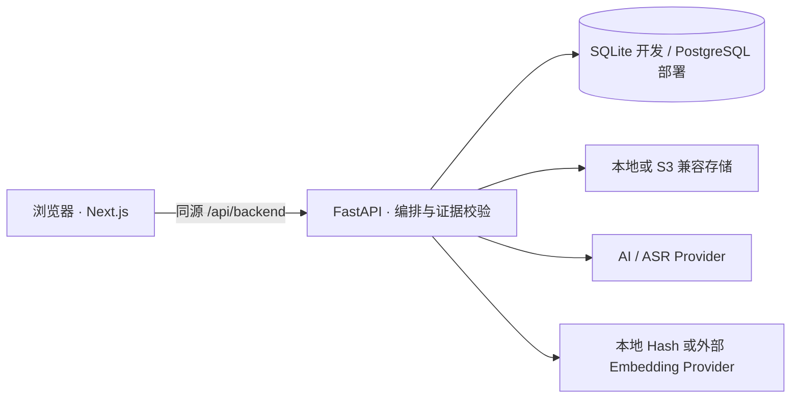

# KnowledgeDebt

> **课堂可以缺席，知识不能欠账。**

KnowledgeDebt 是一个开源、Web-first 的课程恢复系统，面向“课堂已经发生，但学生尚未真正掌握”的场景。它从录音、课件、教材、笔记等证据中还原一次真实的 **Course Session**，生成带来源的从零学习路径，计算知识债务，并且只在积累足够的掌握证据后清债。

[English](README.en.md) · [部署指南](docs/deployment.md) · [隐私模型](docs/privacy.md) · [数据库迁移](docs/migrations.md) · [架构决策](docs/architecture/0001-web-first-thin-backend.md)

> 当前为实验性 `0.x` 版本：核心闭环可运行且有自动化验收，但 API 与数据结构在未来 `1.0` 前仍可能演进。

## 它解决什么问题

Course Session 代表一次真实发生的课堂。即使没有录音、没有 PPT、甚至还没有任何资料，它仍然合法存在。音频、视频、课件、教材、笔记、作业与链接只是附着在 Session 上的证据，不是 Session 本身。

```text
Course Session → 证据 → 课堂还原 → Knowledge Point
→ 从零学习路径 → 自适应 Mastery Assessment → 缺口诊断
→ 针对性补课 → 再验收 → 债务清零 → Session 完成
```

所有功能遵守三个产品不变量：

- 外部资料可以帮助学习，但不能冒充“老师课堂上讲过”的证据；
- 课堂还原可信度与学习资料完备度必须分开计算；
- 阅读或观看不能清债，只有持久化的验收证据可以清债。

## 已实现能力

- Next.js 16 / React 19 响应式浏览器端：债务首页、课程、Session、资料、学习与验收工作区；
- FastAPI 应用 API、可选单用户 Bearer Token，以及不会把令牌暴露到浏览器的同源代理；
- 无资料、无录音也能创建并管理 Course Session；
- 总计 100 分的四通道证据模型：课堂证据 `40`、本节官方资料 `35`、课程上下文 `15`、补充资料 `10`；
- 基于时间并集的录音覆盖率：重叠片段只计算一次，缺失区间不会被平均数掩盖；
- 正式 TranscriptSegment，以及时间戳、PDF 页、PPT 页、Chunk、URL 的来源定位与服务端校验；
- PDF 按页、PPTX 按页、文本按块解析，视觉派生文件、本地向量，以及“课堂还原 / 从零学习”双检索策略；
- 多知识点自适应题目、弱项追问、持久化 MasteryEvidence、知识点依赖阻塞，以及至少两份有效证据才允许清债；
- 转写、索引、分析、出题异步 Job，带阶段、进度、结果与错误状态；
- 可替换 AI、ASR、Embedding、Storage Provider；支持本地文件和 S3 兼容存储；
- 开发默认 SQLite，部署支持 PostgreSQL，包含 SQLAlchemy 元数据与经过测试的 Alembic 迁移；
- Web + API + PostgreSQL 的 Docker Compose 基础配置，约 2 CPU / 2 GB 即可运行薄后端；
- 原 Flutter 原型保存在 `legacy/flutter-client/`，不再是主客户端。

## 架构



默认自托管形态是“薄后端”：服务端运行领域逻辑、校验、检索与存储；高成本 AI / ASR 可以在用户对本次具体操作明确授权后调用外部 Provider。需要全本地推理时，可以通过相同 Provider 接口扩展，而不必改写核心业务。

## 本地开发

需要 Python 3.12+、Node.js 24+、npm 11+。

```bash
git clone https://github.com/HanzhiOvO/KnowledgeDebt.git
cd KnowledgeDebt
make backend-install
make web-install
cp .env.example .env
make dev
```

打开 `http://localhost:3000`；API 位于 `http://127.0.0.1:8123`。不配置 `KNOWLEDGEDEBT_DATABASE_URL` 时自动使用 SQLite，不需要单独安装数据库服务。

若要使用真实托管分析与转写，在 `.env` 至少设置：

```dotenv
OPENAI_API_KEY=your-key
OPENAI_BASE_URL=https://api.openai.com/v1
KNOWLEDGEDEBT_AI_MODEL=gpt-5-mini
KNOWLEDGEDEBT_ASR_MODEL=gpt-4o-mini-transcribe
```

默认 Embedding Provider 为本地确定性 `hash` 实现，因此上传文档不会静默外传文本。外部 Embedding 只会在一次明确同意的索引操作中调用。

## Docker Compose 部署

```bash
cp .env.example .env
# 在 .env 设置强 POSTGRES_PASSWORD；若服务不只监听本机，
# 同时设置强 KNOWLEDGEDEBT_ACCESS_TOKEN。
docker compose up --build
```

打开 `http://localhost:3000`。PostgreSQL 与资源文件使用命名卷，API 的 `8123` 端口只绑定回环地址。更多细节见[部署指南](docs/deployment.md)。

## 隐私边界

每次外部调用的确认框都会列出：操作类型、Provider、涉及的具体资源、将发送什么、不会发送什么。授权只对这一次操作有效，不保存为全局同意。

- API Key 与可选访问令牌只保存在服务端环境变量；
- 浏览器写操作通过 Next.js 同源代理；
- 只有转写所选媒体时才发送原始音视频；
- 分析与验收发送检索出的文本 / 转写片段，不发送原始媒体二进制；
- 外部 Embedding 默认关闭，上传动作绝不会自动调用；
- 模型返回的资源 ID、时间戳、PDF 页、PPT 页和 Chunk 都必须通过服务端证据校验。

录制课堂仍需遵守所在地法律、学校规定、课程规则与现场其他人的合理预期；需要时必须先取得授权。详见[隐私模型](docs/privacy.md)。

## 运行测试

安装全部依赖并运行主验证：

```bash
make backend-install
make web-install
make verify
```

也可以分别运行：

```bash
make backend-lint   # Ruff
make backend-test   # Pytest
make web-test       # ESLint + TypeScript + Next.js 生产构建
make migrate        # Alembic 升级到最新版本
```

测试套件会现场生成结构真实的 90 分钟 WAV、40 页 PPTX 与 80 页 PDF，并完整经过 multipart 上传、文档解析、本地索引、带时间戳转写、双策略检索、课堂还原、针对性补课、自适应验收、MasteryEvidence 聚合、依赖更新与 Session 清债。CI 还会在 PostgreSQL 16 上执行 Alembic 和仓储查询流程。

旧 Flutter 检查仍可通过 `make legacy-client-test` 运行，但开发主 Web 产品不需要 Flutter。

## 项目目录

```text
web/                    Next.js 主客户端
backend/app/            FastAPI 领域、Provider、检索、存储与数据库
backend/alembic/        版本化数据库迁移
backend/tests/          单元、集成、迁移与现实规模 E2E
legacy/flutter-client/  保留的实验性原生原型
docs/                   架构、隐私、部署与迁移说明
compose.yaml            Web + API + PostgreSQL 部署
```

## 当前状态与方向

现在已经完成：知识债务全闭环、证据定位校验、自适应掌握度、后台 Job、Provider / Storage 边界、Web-first UI、PostgreSQL 部署路径和跨层自动化验收。

后续适合推进：学习页的来源原页预览、更完整的录音播放、面向大资料库的 pgvector 检索、可选本地 Whisper / LLM、无障碍与本地化，以及独立的托管多用户身份方案。

当前不承诺：社交网络、公共题库、教务系统集成、支付或教师管理产品。

## Vibe Coding 声明

KnowledgeDebt 是通过 Vibe Coding 工作流构建的开源实验项目。产品意图、需求、架构决策、实现与验证由人类创作者和 AI Coding Agent 协作完成。这是在人类产品所有权下进行的 AI-assisted engineering，并公开保留可验证的工程结果。

项目 Owner：**HanzhiOvO**

## 贡献与许可

修改产品模型或数据结构前请阅读 [CONTRIBUTING.md](CONTRIBUTING.md)。KnowledgeDebt 使用 [MIT License](LICENSE)。
