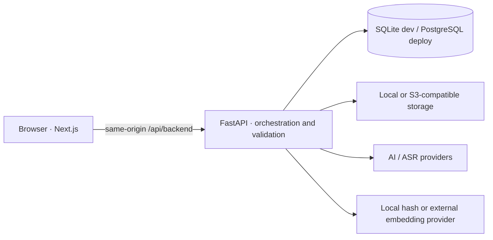

# KnowledgeDebt

> Classroom attendance may fail. Learning continuity should not.

KnowledgeDebt is an open-source, Web-first system for recovering lectures a student missed or did not master. It reconstructs a real **Course Session** from evidence, builds a source-grounded learning path, measures knowledge debt, and clears that debt only after sufficient mastery evidence.

[中文说明](README.zh-CN.md) · [Deployment](docs/deployment.md) · [Privacy](docs/privacy.md) · [Architecture decision](docs/architecture/0001-web-first-thin-backend.md)

> Experimental `0.x` software: the learning model is usable and tested, but APIs and schemas may still evolve before a future `1.0`.

## The product model

A Course Session represents one class that really happened. It exists even when there is no recording and no material yet. Audio, video, slides, textbooks, notes, assignments, and links are evidence attached to that Session—not the Session itself.

```text
Course Session → evidence → classroom reconstruction → Knowledge Points
→ from-zero learning path → adaptive Mastery Assessment → gap diagnosis
→ targeted remediation → reassessment → debt cleared → Session complete
```

Three invariants shape every feature:

- external material may teach a topic but cannot prove what a teacher covered;
- reconstruction confidence and learning-material coverage are separate measurements;
- reading or watching never clears debt—persisted assessment evidence does.

## What is implemented

- responsive Next.js 16 / React 19 browser client with debt-first home, Courses, Sessions, evidence, learning, and assessment workspaces;
- FastAPI application API with optional single-user bearer-token protection and a same-origin Web proxy that keeps secrets server-side;
- Course Sessions that are valid with zero recordings or resources;
- a four-channel evidence profile totaling 100: classroom `40`, official Session material `35`, course context `15`, supplementary material `10`;
- timeline-aware recording union coverage, so overlapping clips are counted once and gaps stay visible;
- formal transcript segments and validated source locators for timestamps, PDF pages, PPT slides, chunks, and URLs;
- PDF page, PPTX slide, and text chunk extraction, visual derivatives, deterministic local embeddings, and reconstruction/learning retrieval policies;
- adaptive multi-Knowledge-Point questions, targeted follow-ups, persisted MasteryEvidence, dependency blocking, and a two-evidence minimum before mastery;
- asynchronous transcription, indexing, analysis, and assessment jobs with stage/progress/result state;
- replaceable AI, ASR, embedding, and storage providers; local storage and S3-compatible storage are supported;
- SQLite for zero-configuration development, PostgreSQL for deployment, SQLAlchemy metadata, and tested Alembic migrations;
- Docker Compose for Web + API + PostgreSQL within an approximately 2 CPU / 2 GB base profile;
- a preserved Flutter prototype under `legacy/flutter-client/`; it is no longer the primary client.

## Architecture



The default self-hosted profile is intentionally thin: application logic, validation, retrieval, and storage run on the server; expensive AI/ASR may use external providers only after an operation-specific consent step. Local provider implementations remain possible through the same contracts.

## Quick start: local development

Requirements: Python 3.12+, Node.js 24+, and npm 11+.

```bash
git clone https://github.com/HanzhiOvO/KnowledgeDebt.git
cd KnowledgeDebt
make backend-install
make web-install
cp .env.example .env
make dev
```

Open `http://localhost:3000`. The API listens on `http://127.0.0.1:8123`. Without `KNOWLEDGEDEBT_DATABASE_URL`, data and resources stay under the configured local data directory and SQLite requires no separate service.

To enable real hosted analysis and transcription, set at least:

```dotenv
OPENAI_API_KEY=your-key
OPENAI_BASE_URL=https://api.openai.com/v1
KNOWLEDGEDEBT_AI_MODEL=gpt-5-mini
KNOWLEDGEDEBT_ASR_MODEL=gpt-4o-mini-transcribe
```

The default embedding provider is the local deterministic `hash` provider, so document upload never silently sends text elsewhere. External embedding calls are deferred until an explicit indexing consent action.

## Quick start: Docker Compose

```bash
cp .env.example .env
# Set a strong POSTGRES_PASSWORD and, if exposed beyond localhost,
# a strong KNOWLEDGEDEBT_ACCESS_TOKEN in .env.
docker compose up --build
```

Open `http://localhost:3000`. PostgreSQL and resource storage use named volumes; the API is bound to loopback on port `8123`. See [deployment documentation](docs/deployment.md) for reverse proxy, S3, backups, migrations, and low-resource operation.

## Privacy boundary

The confirmation dialog identifies the operation, provider, exact resources, data that will be sent, and data that will not be sent. Consent is one operation only; it is not stored as a blanket preference.

- API keys and the optional access token stay in server environment variables.
- Browser mutations go through the same-origin Next.js proxy.
- Original media is sent only for a selected transcription operation.
- Analysis and assessment use retrieved text/transcript subsets, not original media binaries.
- External embedding is off by default and is never triggered automatically by upload.
- Model-produced resource IDs, timestamps, pages, slides, and chunks are validated against stored evidence.

Recording a class may require permission under local law, school policy, course rules, or the expectations of other people in the room. Self-hosting changes where data is processed; it does not remove that responsibility. Read the full [privacy model](docs/privacy.md).

## Verification

```bash
make verify
make migrate
```

The test suite includes a synthetically generated but structurally real 90-minute WAV recording, a 40-slide PPTX, and an 80-page PDF. They pass through multipart upload, document parsing, local indexing, timestamped transcription, dual-policy retrieval, reconstruction, remediation, adaptive assessment, MasteryEvidence aggregation, dependency updates, and Session completion. CI additionally runs the Alembic migration and repository flow against PostgreSQL 16.

Primary checks:

```bash
make backend-lint
make backend-test
make web-test
```

The legacy Flutter checks remain available as `make legacy-client-test`, but Flutter is not needed to run or develop the primary Web product.

## Repository map

```text
web/                    Next.js primary client
backend/app/            FastAPI domain, providers, retrieval, storage, database
backend/alembic/        versioned schema migrations
backend/tests/          unit, integration, migration, and realistic E2E tests
legacy/flutter-client/  preserved experimental native prototype
docs/                   architecture, privacy, deployment, and migration notes
compose.yaml            Web + API + PostgreSQL deployment
```

## Status and direction

Implemented now: the full learning-debt loop, evidence validation, adaptive mastery, jobs, provider/storage boundaries, Web-first UI, PostgreSQL deployment path, and automated cross-layer verification.

Likely next work: source-page preview in the learning UI, richer recording playback, pgvector-backed retrieval for large libraries, optional local Whisper/LLM packages, accessibility, localization, and hosted multi-user identity as a separate deployment profile.

Not currently promised: a social network, public question bank, school-system integration, payments, or a teacher administration product.

## Vibe Coding

KnowledgeDebt is an open-source experimental project built through a Vibe Coding workflow. Product intent, requirements, architecture decisions, implementation, and verification are developed collaboratively by a human creator and AI coding agents. This is AI-assisted engineering under human-directed product ownership, with verification kept visible.

Project owner: **HanzhiOvO**

## Contributing and license

Read [CONTRIBUTING.md](CONTRIBUTING.md) before changing the product model or schema. KnowledgeDebt is released under the [MIT License](LICENSE).
