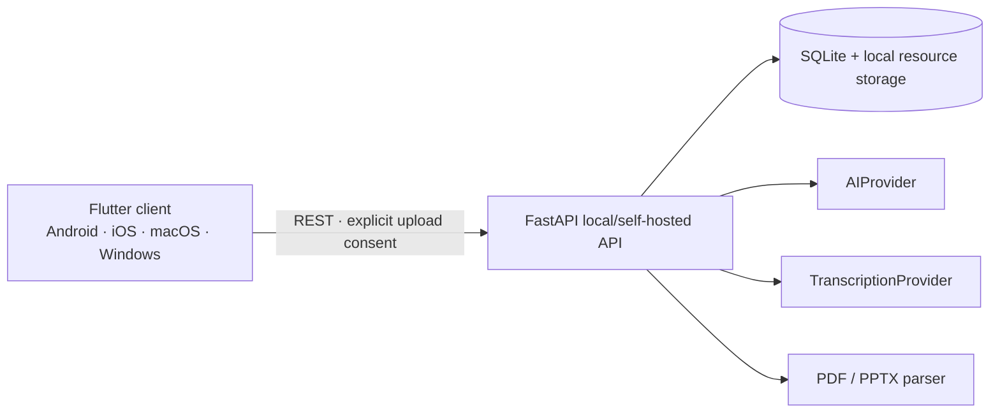

# KnowledgeDebt

**Classroom attendance may fail. Learning continuity should not.**

KnowledgeDebt is an open-source, local-first learning recovery app for university students. It tracks classes that have already happened but are not yet genuinely mastered, reconstructs what likely happened from evidence of different trust levels, builds a from-zero learning path, and clears debt only after a source-grounded mastery assessment.

> 课堂可以缺席，知识不能欠账。

[中文文档](README.zh-CN.md)

## Why this project exists

A student can miss a lecture, lose focus, leave a phone recording in the room, or have no recording at all. A class still happened. KnowledgeDebt models that class as a **Course Session**, independent of any recording, then helps the student restore learning continuity.

This is deliberately not a “record → transcribe → summarize” app. Its complete loop is:

```text
Course Session → evidence → classroom reconstruction → knowledge points
→ from-zero learning path → source-grounded assessment → gap diagnosis
→ targeted remediation → reassessment → debt cleared → Session complete
```

## Core concepts

- **Course Session** — one real class occurrence. Audio is optional evidence, never the Session itself.
- **Classroom Reconstruction** — what the teacher actually covered, split into confirmed and inferred claims with source references.
- **Reconstruction Score** — confidence in restoring what happened. It uses `weight × coverage × quality × relevance`, with duplicate source types saturating instead of stacking.
- **Learning Coverage** — a separate estimate of whether current material can teach the class from zero.
- **Knowledge Debt** — a course-required Knowledge Point whose current mastery is below its target level.
- **Mastery Assessment** — 3–5 source-grounded questions evaluated semantically against explicit rubrics. Reading a note never clears debt.

Evidence has three trust levels: real classroom evidence, official course material, and supplementary learning material. Supplementary material can teach a concept but must never be presented as proof that the teacher covered it.

## Implemented in this MVP

- Flutter client generated for Android, iOS, macOS, and Windows from one codebase
- onboarding, debt-first home, Courses, Course Sessions, Session detail, resources, reconstruction, learning path, debt, quiz, recording, and settings screens
- Course Profile weights editable per course
- Session creation with zero resources; “no recording” is a normal empty state
- local recording with pause/resume, explicit stop, navigation guard, and five-minute safety segments
- local upload of audio, video, PDF, PPTX, text, notes, textbook, syllabus, and assignments
- resource coverage, quality, and Session relevance controls
- PDF/PPTX/text extraction; legacy `.ppt` is stored but intentionally receives low effective quality until converted
- SQLite entities for resources, transcript segments, reconstructions, Knowledge Points, learning steps, debts, questions, attempts, and targeted remediations
- independent reconstruction and learning-coverage scoring
- replaceable `AIProvider` and `TranscriptionProvider` protocols
- a real OpenAI-compatible structured JSON implementation for analysis, quiz generation, semantic answer evaluation, remediation, and ASR
- explicit consent gate before every AI/ASR external upload
- mastery levels 0–4, target-aware debt state, focused remediation, reassessment, and automatic Session completion
- local cached home/course metadata for offline browsing
- automated backend unit/integration tests, Flutter widget test, linting, and GitHub Actions CI

## Architecture



The backend stores structured domain objects, not one large Markdown result. See [`backend/app/database.py`](backend/app/database.py) for the schema and [`backend/app/providers/base.py`](backend/app/providers/base.py) for provider contracts.

## Getting started

Requirements:

- Flutter stable 3.35+ (the current repository was verified with Flutter 3.47 / Dart 3.13)
- Python 3.12+
- platform toolchains for the targets you intend to build

```bash
git clone https://github.com/HanzhiOvO/KnowledgeDebt.git
cd KnowledgeDebt
python3 -m venv .venv
.venv/bin/pip install -r backend/requirements-dev.txt
cp .env.example .env
```

Configure `.env`, then start the API:

```bash
make backend-run
```

In another terminal:

```bash
cd client
flutter pub get
flutter run
```

The default endpoint is `http://127.0.0.1:8123` on desktop/iOS and `http://10.0.2.2:8123` on the Android emulator. It can be changed in Settings. For a physical phone, use a reachable LAN address and review your firewall.

## AI and ASR configuration

```dotenv
OPENAI_API_KEY=your-key
OPENAI_BASE_URL=https://api.openai.com/v1
KNOWLEDGEDEBT_AI_MODEL=gpt-5-mini
KNOWLEDGEDEBT_ASR_MODEL=gpt-4o-mini-transcribe
```

Keys stay in the backend environment and are never returned to the Flutter client. The implementation uses OpenAI-compatible Chat Completions structured output and audio transcription endpoints. Provider contracts are separate from the application service so another hosted or local implementation can be added without changing the domain pipeline.

## Privacy

Record only when allowed by local law, university policy, course rules, and the people involved. Obtain permission when required.

- recordings begin locally and use safety segments;
- attaching a recording clearly identifies the configured backend destination;
- AI/ASR actions show a separate consent prompt;
- `.env`, databases, and common media formats are ignored by Git;
- resource content and API keys are not written to application logs.

Self-hosting the backend is recommended for sensitive course material. “Local-first” does not mean “nothing can ever leave the device”; the UI makes the boundary visible before it does.

## Verification

```bash
make verify
```

The backend integration test executes:

```text
Course → Session → Resource → Reconstruction → Knowledge Point → Debt
→ targeted remediation → Question → semantic evaluation → Mastery → Session complete
```

## Roadmap

**Done:** the usable learning-debt loop described above, provider abstraction, privacy gates, tests, four-platform project scaffolding, and CI.

**In progress:** real-device UX validation, richer audio timeline playback, source-page preview, and resilient background recording on every OS version.

**Planned:** optional local Whisper/LLM providers, learned Course Profiles, richer dependency-aware daily minimum planning, sync, and accessibility/localization polish.

Not currently implemented: social features, school-system login, web crawling, payments, a public question bank, or a teacher product.

## Vibe Coding

KnowledgeDebt is an open-source experimental project built through a vibe-coding workflow. Product vision, requirements, architecture discussions, and substantial implementation work are collaboratively driven by a human creator and AI coding agents. It is AI-assisted development with human-directed product design, not an attempt to hide AI involvement or substitute claims for verification.

Project owner: **HanzhiOvO**

## Contributing

See [CONTRIBUTING.md](CONTRIBUTING.md). Please preserve the three product invariants: a Session is not a recording; debt means required but not yet mastered; only assessment can clear debt.

## License

[MIT](LICENSE)

