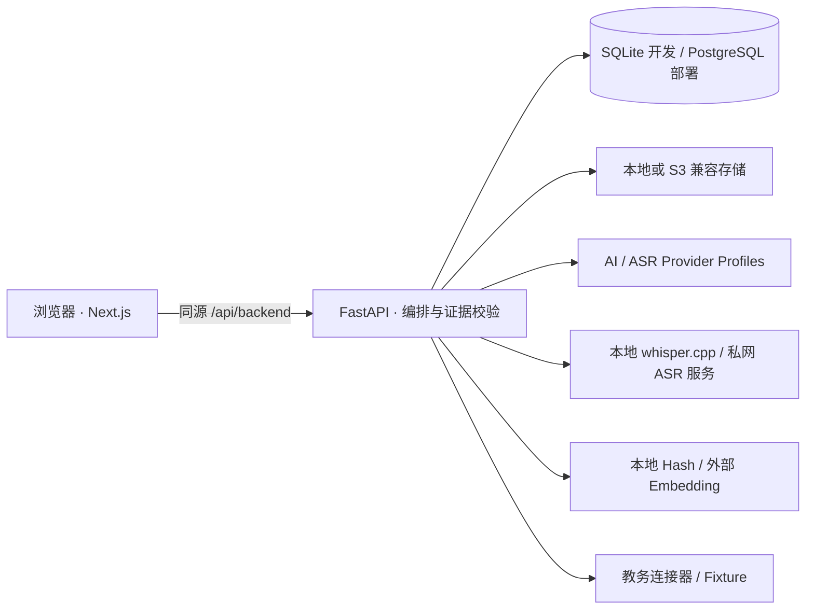

# KnowledgeDebt

> **课堂可以缺席，知识不能欠账。**

[](https://github.com/HanzhiOvO/KnowledgeDebt/actions/workflows/ci.yml)
[](LICENSE)
[](#v02--自动化课程工作台)

KnowledgeDebt 是一个开源、Web-first、本地优先的课程恢复系统。它把课表、录音、课件、教材和笔记组织成真实的 **Course Session**，生成可追溯的课堂还原与从零学习路径，并且只在积累足够的掌握证据后清除知识债务。

[English](README.en.md) · [文档中心](docs/README.md) · [Provider 与密钥](docs/providers.md) · [本地 ASR](docs/local-asr.md) · [教务连接器](docs/zjsu-schedule.md) · [FFmpeg](docs/ffmpeg.md) · [隐私模型](docs/privacy.md)

> 当前为实验性 `0.x` 版本。核心闭环可运行且有自动化验证，但 API 与数据结构在 `1.0` 前仍可能演进。

## v0.2 · 自动化课程工作台

默认导航为：**总览、课表、课程、待审核、设置**。

```text
课表同步 → Occurrence → 课堂发生 / 打开 / 收到证据 → Session
→ 原始录音先保存 → 自动转写 → 主题候选 → 人工审核
→ 课堂还原 → 从零学习 → 掌握验收 → 债务清零
```

本版本新增：

- Academic Term、Schedule Rule、Occurrence 与惰性 Session 物化；未来课表不会提前制造债务，停课不会创建 Session；
- 浏览器录音与媒体上传“先保存、后自动化”，保存失败时保留原录音并支持重试；
- 本地或外部 ASR 自动转写，完整呈现保存、准备、授权、排队、转写、部分完成、失败、取消等状态；
- 真实本地转写适配器：本机 whisper.cpp 命令行与私网 OpenAI 兼容 ASR 服务，音频不出本机或私网，公网地址会被拒绝；超时与取消会真正终止本地进程，取消后的分片可断点续跑；
- FFmpeg 长录音规范化与持久化分片，成功分片跳过、失败分片续跑、全课堂时间戳合并和重启接管；
- AI、ASR、Embedding 独立 Provider Profile、能力声明、默认路由、连接测试与无敏感正文的调用台账；
- 外部转写逐次精确授权：授权前不创建 Job，取消只保留“未转写”，重试无需再次上传；
- 全局快速收件箱按时间、课程别名和上下文给出匹配理由，低置信度进入统一待审核中心；
- 课程主题候选、归档匹配和其他不确定自动化统一支持接受、编辑后接受、拒绝、稍后处理；
- Zhejiang Gongshang University 本科教务 V-9.0 的安全连接器边界与脱敏 fixture 导入；实时登录尚未在授权环境验证，因此不会猜接口或绕过验证码。

系统不包含提醒、通知或推送功能。

## 一键启动

需要 Python 3.12+、Node.js 20+（推荐 24）和 npm。在 macOS / Linux 终端执行：

```bash
git clone https://github.com/HanzhiOvO/KnowledgeDebt.git
cd KnowledgeDebt
./start.sh
```

脚本会自动创建 `.env`、Python 虚拟环境并补齐项目依赖，然后同时启动：

- 课程工作台：`http://localhost:3000`
- 本地 API：`http://127.0.0.1:8123`

首次运行需要下载依赖，之后会复用本地环境。按 `Ctrl+C` 可同时停止两个服务。默认 SQLite、本地文件存储、本地 Hash Embedding；不配置密钥也能启动，不会自动调用付费 API。

长录音规范化需要 FFmpeg。脚本只检测并提示，不会擅自安装系统软件；安装方法见 [docs/ffmpeg.md](docs/ffmpeg.md)。

想把转写完全留在本机或寝室服务器（无 GPU 也可用），见 [docs/local-asr.md](docs/local-asr.md)：安装 whisper.cpp、下载 ggml 模型、配置 `KNOWLEDGEDEBT_LOCAL_ASR_*`，「设置 → Provider」会显示真实就绪状态。仓库不会自动下载模型或安装系统软件。

传统命令仍然可用：

```bash
make backend-install
make web-install
make dev
```

## 真实能力与隐私边界

- 原始文件先持久化；转写、匹配或 Provider 失败不会删除原文件；
- Session 即使没有录音或课件也合法存在，资源只是证据，不是 Session 本身；
- 外部资料可以帮助学习，但不能冒充教师课堂证据；
- 阅读或观看不能清债，只有持久化的验收证据可以清债；
- 外部调用确认框显示实际 Vendor、Profile、模型、资源和发送范围，授权只对本次操作有效；
- Provider 密钥只允许加密存储或引用服务端环境变量，拒绝明文落库；
- 模型返回的资源 ID、时间戳、PDF/PPT 页和 Chunk 必须通过服务端证据校验；
- 当前可工作的通用实现是 OpenAI-compatible 与本地 Hash Embedding；其他名称会明确标记“未实测预设”或“接口槽位”，不会冒充已经验证。

录制课堂仍需遵守所在地法律、学校规定、课程规则与现场其他人的合理预期，并在需要时先取得授权。

## 教务同步

“设置 → 教务同步”可查看连接能力，“课表”可导入脱敏 fixture。示例文件：

```text
docs/fixtures/zjsu-schedule.example.json
```

当前没有可验证的授权登录会话，所以实时账号/SSO/扫码登录保持禁用。完整边界和后续接入材料见 [docs/zjsu-schedule.md](docs/zjsu-schedule.md)。

## 运行测试

```bash
make verify
```

或分别运行：

```bash
make backend-lint
make backend-test
make web-test
make migrate
```

新增 v0.2 专项回归覆盖密钥安全、课表 fixture 与单双周、Occurrence 惰性物化、停课保护、收件箱/审核幂等、外部授权前零 Job，以及分片失败后的断点续跑。本地 ASR 回归（`backend/tests/test_local_asr.py`）使用真实子进程与 127.0.0.1 回环服务，覆盖命令行契约、时间戳解析、超时与取消真正杀进程、私网地址守卫和运行中取消后的续跑。测试使用本地假 Provider，不消耗付费 API，也不下载模型。

## 项目目录

```text
.github/                中文 Issue / PR 模板与持续集成
backend/app/            FastAPI 领域逻辑、自动化、Provider、教务与转写编排
backend/alembic/        SQLite / PostgreSQL 版本化迁移
backend/tests/          单元、集成、迁移、现实规模 E2E 与 v0.2 回归
web/                    Next.js 16 / React 19 主客户端
docs/                   中文架构、隐私、部署、Provider、教务与 FFmpeg 说明
legacy/flutter-client/  只读保留的实验性 Flutter 原型
deploy/local-asr/        可选的私网 whisper.cpp HTTP 服务（未实测，需操作者验证）
compose.yaml            Web + API + PostgreSQL 部署栈，含可选 local-asr profile
start.sh                自动补齐依赖并同时启动 Web 与 API
```

## 技术结构



原 Flutter 原型不再是主客户端。项目当前不承诺社交网络、公共题库、支付、教师管理、通知推送或未经验证的实时教务连接。

## Vibe Coding 声明

KnowledgeDebt 通过 Vibe Coding 工作流构建。产品意图、需求、架构决策、实现与验证由人类创作者和 AI Coding Agent 协作完成，并公开保留可验证的工程结果。

项目 Owner：**HanzhiOvO**

## 贡献与许可

修改产品模型或数据结构前请阅读 [CONTRIBUTING.md](CONTRIBUTING.md)。KnowledgeDebt 使用 [MIT License](LICENSE)。
