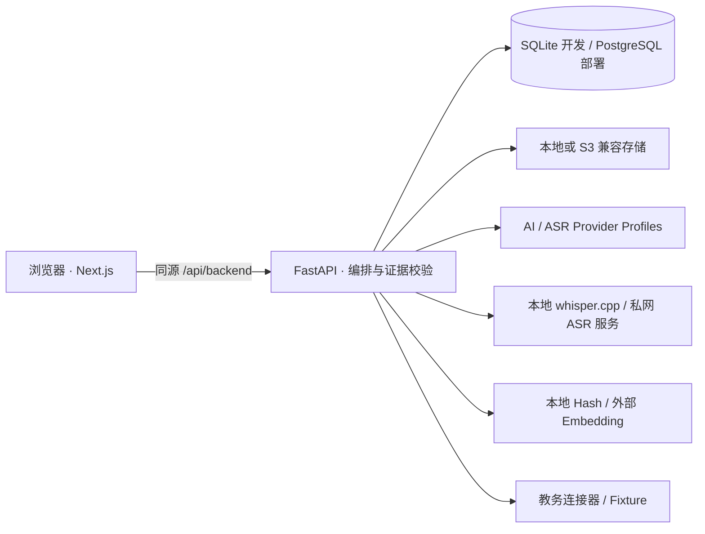

# 知债 KnowledgeDebt

> **课堂可以缺席，知识不能欠账。**

[](https://github.com/HanzhiOvO/KnowledgeDebt/actions/workflows/ci.yml)
[](LICENSE)
[](#v02--自动化课程工作台)

知债（KnowledgeDebt）是一个开源、Web-first、本地优先的课程恢复系统。它把课表、录音、课件、教材和笔记组织成真实的 **Course Session**，生成可追溯的课堂还原与从零学习路径，并且只在积累足够的掌握证据后清除知识债务。

[English](README.en.md) · [macOS 安装与数据管理](docs/macos.md) · [v0.2 发布与验收](docs/release-v0.2.md) · [文档中心](docs/README.md) · [Provider 与密钥](docs/providers.md) · [本地 ASR](docs/local-asr.md) · [教务连接器](docs/zjsu-schedule.md) · [隐私模型](docs/privacy.md)

> 当前为实验性 `0.x` 版本。核心闭环可运行且有自动化验证，但 API 与数据结构在 `1.0` 前仍可能演进。

## macOS 原生安装（普通用户推荐）

面向 macOS 13+ Apple Silicon（M1/M2/M3/M4）的安装包已经内置 Python、Node.js、FFmpeg、ffprobe 和 whisper.cpp 运行时。普通用户不需要安装 Docker、Homebrew、数据库或开发环境：

1. 从项目 Release 或交付目录下载 `KnowledgeDebt-0.2.0-arm64.dmg`；
2. 双击 DMG，把 `KnowledgeDebt.app` 拖入“应用程序”；
3. 打开应用，等待菜单栏 `KD` 显示“本地服务运行中”；
4. 在“设置 → 本地转写模型”中主动选择并下载模型，课堂推荐兼顾 CPU 速度与术语准确率的 `Whisper Large v3 Turbo Q5`。

安装包不包含大型模型，也不会未经确认下载。模型支持进度显示、取消、断点续传、固定 SHA-256 校验、切换、删除和损坏后重下。没有模型时录音仍会可靠保存，只显示“等待配置转写”。

当前可复现构建在没有 Developer ID 时使用 ad-hoc 签名且未 notarize；首次打开可能需要在 Finder 中右键选择“打开”。安装、校验、升级、备份、恢复和彻底卸载步骤见 [macOS 安装与数据管理](docs/macos.md)。

## v0.2 · 自动化课程工作台

默认导航为：**总览、课表、课程、待审核、设置**。

```text
课表同步 → Occurrence → 课堂发生 / 打开 / 收到证据 → Session
→ 原始录音先保存 → 自动转写 → 主题候选 → 人工审核
→ 课堂还原 → 从零学习 → 掌握验收 → 债务清零
```

本版本新增：

- Academic Term、Schedule Rule、Occurrence 与惰性 Session 物化；未来课表不会提前制造债务，停课不会创建 Session；
- 浏览器录音与媒体上传“先保存、后自动化”，保存失败时保留原录音并支持重试；
- 本地或外部 ASR 自动转写，媒体上传统一服从全局自动转写偏好，完整呈现保存、准备、授权、排队、转写、部分完成、失败、取消等状态；
- 真实本地转写适配器：本机 whisper.cpp 命令行与私网 OpenAI 兼容 ASR 服务，音频不出本机或私网，公网地址会被拒绝；超时与取消会真正终止本地进程，取消后的分片可断点续跑；
- FFmpeg 长录音规范化与持久化分片，成功分片跳过、失败分片续跑、全课堂时间戳合并和重启接管；
- AI、ASR、Embedding 独立 Provider Profile、能力声明、默认路由、连接测试与无敏感正文的调用台账；
- 未配置外部 API 时，AI 分析默认使用完全离线的透明规则引擎；它只整理真实资料并明确标注推断，不伪装成大模型；
- 外部转写逐次精确授权：授权前不创建 Job，取消只保留“未转写”，重试无需再次上传；
- 全局快速收件箱按时间、课程别名和上下文给出匹配理由，低置信度进入统一待审核中心；
- 转写完成后自动提取课堂主题并更新“课程-日期-主题”标题；短或模糊主题进入待审核，用户在 Session 页面手动修改并锁定后不会再被覆盖；
- 课程主题候选、归档匹配和其他不确定自动化统一支持接受、编辑后接受、拒绝、稍后处理；
- Zhejiang Gongshang University 本科教务 V-9.0 的安全连接器边界与脱敏 fixture 导入；实时登录尚未在授权环境验证，因此不会猜接口或绕过验证码。

系统不包含提醒、通知或推送功能。

## 开发者一键启动

需要 Python 3.12+、Node.js 24+ 和 npm。在 macOS / Linux 终端执行：

```bash
git clone https://github.com/HanzhiOvO/KnowledgeDebt.git
cd KnowledgeDebt
./start.sh
```

脚本会自动创建 `.env`、Python 虚拟环境并补齐项目依赖，然后同时启动：

- 课程工作台：`http://localhost:3000`
- 本地 API：`http://127.0.0.1:8123`

首次运行需要下载依赖，之后会复用本地环境。按 `Ctrl+C` 可同时停止两个服务。默认 SQLite、本地文件存储、本地 Hash Embedding；不配置密钥也能启动，不会自动调用付费 API。

Windows 10/11 可在仓库根目录双击 `start.bat`，或在 PowerShell 中执行：

```powershell
.\start.ps1
```

三种源码入口都只监听本机回环地址，不会默认把开发服务暴露给同一局域网的其他设备。

## 寝室服务器 / 校园网访问

GMK G10 使用 Windows 时，只需预先安装一次 Docker Desktop。以后在仓库根目录**双击 `一键启动服务器.bat`**（等价于 `server.bat`）：脚本会自动启动 Docker Desktop，首次弹出供应商选择并隐藏输入 API Key，生成数据库安全值、申请本地子网防火墙规则、启动全部服务并打开本机页面。

其他电脑、平板和手机不需要安装 KnowledgeDebt，也不需要配置 API Key，只要打开窗口中显示的 `http://GMK-G10-局域网-IP:3000`。API Key 只存在 GMK G10 的 `.env` 和后端容器环境中，不会下发给浏览器。

需要更换 Key、供应商或模型时，双击 `配置AI服务.bat`（等价于 `server-configure.bat`）。当前首次向导支持 OpenCode Go、OpenAI、DeepSeek、OpenCode Zen 和自定义 OpenAI-compatible 服务。OpenCode Go 默认使用其 OpenAI-compatible 端点与 `deepseek-v4-flash`；非 OpenAI 服务只配置 AI 分析，并默认关闭不受支持的云端自动转写。

Linux 服务器仍可使用：

```bash
./server.sh
```

Compose 只向局域网发布 Web 端口；FastAPI 8123 固定绑定服务器自身的 `127.0.0.1`，浏览器统一通过 Web 的同源代理访问后端。

不使用 Docker 时，也可以临时运行源码局域网模式：

```bash
./start.sh --lan

# Windows
.\start.ps1 -Lan
```

防火墙只放行 TCP 3000，不要放行 8123。校园网可能启用设备隔离；如果 GMK G10 本机能打开、其他设备超时，需要检查 Windows/Linux 防火墙及校园网 AP 隔离，而不是把 API 暴露出去。完整的首次部署、开机自启、地址固定、验证和排障步骤见 [寝室服务器部署](docs/deployment.md#gmk-g10-寝室服务器与校园网访问)。

> 当前是单用户自托管应用，不提供多用户账号隔离。能打开前端的设备也能操作同一份课程数据；若只希望自己的设备访问，优先使用自有路由器的私有 LAN 或 Tailscale 等私网方案，不要把 3000 端口映射到公网。

长录音规范化需要 FFmpeg。脚本只检测并提示，不会擅自安装系统软件；安装方法见 [docs/ffmpeg.md](docs/ffmpeg.md)。

原生安装包已内置 whisper.cpp 和 FFmpeg；源码开发或寝室服务器部署仍可自行安装运行时。完整方案见 [docs/local-asr.md](docs/local-asr.md)。源码模式不会擅自安装系统软件或自动下载模型。

传统命令仍然可用：

```bash
make backend-install
make web-install
make dev
```

## 真实能力与隐私边界

- 原始文件先持久化；转写、匹配或 Provider 失败不会删除原文件；
- Session 即使没有录音或课件也合法存在，资源只是证据，不是 Session 本身；
- 外部资料可以帮助学习，但不能冒充教师课堂证据；
- 阅读或观看不能清债，只有持久化的验收证据可以清债；
- 外部调用确认框显示实际 Vendor、Profile、模型、资源和发送范围，授权只对本次操作有效；
- Provider 密钥只允许加密存储或引用服务端环境变量，拒绝明文落库；
- 模型返回的资源 ID、时间戳、PDF/PPT 页和 Chunk 必须通过服务端证据校验；
- 当前可工作的通用实现是本地规则引擎、OpenAI-compatible、本地 whisper.cpp 与本地 Hash Embedding；其他名称会明确标记“未实测预设”或“接口槽位”，不会冒充已经验证。

录制课堂仍需遵守所在地法律、学校规定、课程规则与现场其他人的合理预期，并在需要时先取得授权。

## 教务同步

“设置 → 教务同步”可查看连接能力，“课表”可导入脱敏 fixture。示例文件：

```text
docs/fixtures/zjsu-schedule.example.json
```

当前没有可验证的授权登录会话，所以实时账号/SSO/扫码登录保持禁用。完整边界和后续接入材料见 [docs/zjsu-schedule.md](docs/zjsu-schedule.md)。

## 运行测试

```bash
make verify
```

或分别运行：

```bash
make backend-lint
make backend-test
make web-test
make migrate
```

新增 v0.2 专项回归覆盖密钥安全、课表 fixture 与单双周、Occurrence 惰性物化、停课保护、收件箱/审核幂等、外部授权前零 Job，以及分片失败后的断点续跑。本地 ASR 回归使用真实子进程与 127.0.0.1 回环服务；模型管理回归覆盖确认下载、真实 Range 断点、取消后精确续传、重启恢复、SHA-256、损坏重下、切换、删除保护和 API。测试使用本地假 Provider，不消耗付费 API，也不下载大型模型。

## 项目目录

```text
.github/                中文 Issue / PR 模板与持续集成
backend/app/            FastAPI 领域逻辑、自动化、Provider、教务与转写编排
backend/alembic/        SQLite / PostgreSQL 版本化迁移
backend/tests/          单元、集成、迁移、现实规模 E2E 与 v0.2 回归
web/                    Next.js 16 / React 19 主客户端
docs/                   中文架构、隐私、部署、Provider、教务与 FFmpeg 说明
legacy/flutter-client/  只读保留的实验性 Flutter 原型
deploy/local-asr/        可选的私网 whisper.cpp HTTP 服务（未实测，需操作者验证）
packaging/macos/          原生应用、运行时固定版本、签名、冒烟与 DMG 构建
compose.yaml            Web + API + PostgreSQL 部署栈，含可选 local-asr profile
start.sh                自动补齐依赖并同时启动 Web 与 API
start.ps1 / start.bat   Windows 中文一键启动（默认 SQLite，不安装实验性大模型依赖）
server.sh               Linux/macOS 寝室服务器管理（Docker Compose，校园网 Web）
server.ps1 / server.bat Windows 双击启动、首次 Key 向导与本地子网防火墙
server-configure.bat     Windows 更换服务器端 AI Key、供应商或模型
一键启动服务器.bat       面向 Windows 普通用户的中文双击入口
配置AI服务.bat            面向 Windows 普通用户的中文重新配置入口
```

## 技术结构


```mermaid
flowchart LR
  B["浏览器 · Next.js"] -->|"同源 /api/backend"| A["FastAPI · 编排与证据校验"]
  A --> D[("SQLite 开发 / PostgreSQL 部署")]
  A --> S["本地或 S3 兼容存储"]
  A --> P["AI / ASR Provider Profiles"]
  A --> L["本地 whisper.cpp / 私网 ASR 服务"]
  A --> E["本地 Hash / 外部 Embedding"]
  A --> C["教务连接器 / Fixture"]
```

原 Flutter 原型不再是主客户端。项目当前不承诺社交网络、公共题库、支付、教师管理、通知推送或未经验证的实时教务连接。

## Vibe Coding 声明

KnowledgeDebt 通过 Vibe Coding 工作流构建。产品意图、需求、架构决策、实现与验证由人类创作者和 AI Coding Agent 协作完成，并公开保留可验证的工程结果。

项目 Owner：**HanzhiOvO**

## 贡献与许可

修改产品模型或数据结构前请阅读 [CONTRIBUTING.md](CONTRIBUTING.md)。KnowledgeDebt 使用 [MIT License](LICENSE)。
